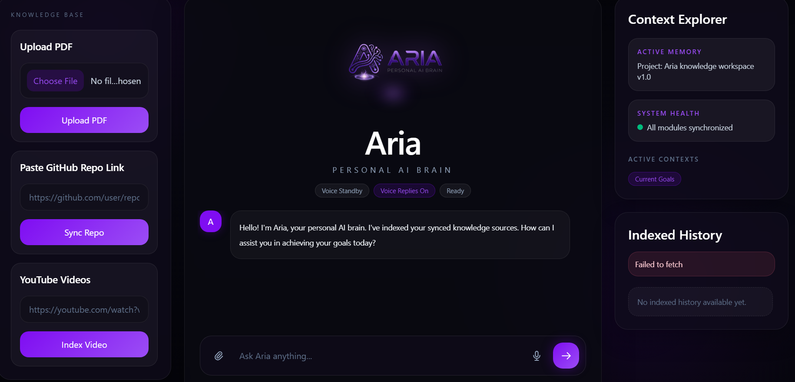
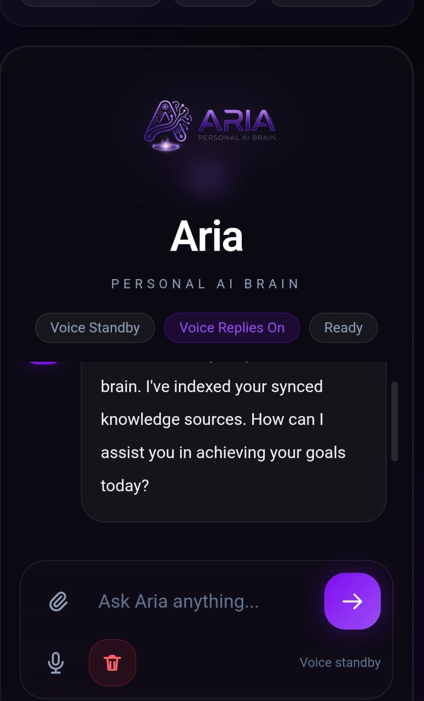

# 🤖 ARIA — Personal Knowledge AI Assistant

ARIA is a **full-stack personal knowledge assistant** that ingests multiple knowledge sources and allows users to query them through an intelligent chat interface powered by **Retrieval-Augmented Generation (RAG)**.

ARIA can process:

* 📄 PDF documents
* ▶️ YouTube video transcripts
* 🧑‍💻 GitHub repositories

The system converts these sources into vector embeddings stored in a semantic database and retrieves the most relevant information to generate contextual answers.

ARIA aims to function as a **personal AI knowledge brain**, allowing users to build a searchable memory of their documents, repositories, and learning resources.

---

# 📸 User Interface




The interface provides a clean, intuitive design featuring:
- **Knowledge Base Management**: Upload PDFs, paste GitHub repo links, and index YouTube videos
- **Interactive Chat**: Real-time conversation with your personal AI brain
- **Status Indicators**: Voice standby and reply status monitoring
- **Indexed History**: Context explorer showing all indexed knowledge sources

---

# ✨ Key Features

### 📚 Multi-Source Knowledge Ingestion

ARIA can ingest knowledge from multiple sources including:

* 📄 PDF documents
* ▶️ YouTube transcripts
* 🧑‍💻 GitHub repositories

Each source is processed and converted into embeddings for semantic retrieval.

---

### 💬 Retrieval-Augmented Chat

ARIA answers questions by retrieving the most relevant knowledge chunks from the vector database and passing them to a language model for contextual response generation.

This ensures:

* grounded answers
* traceable sources
* reduced hallucinations

---

### 🗂️ Source Management

Users can review all indexed knowledge sources through a **knowledge ledger** interface and remove individual sources when needed.

This allows dynamic control of the knowledge base.

---

### 🧠 Vector Database Powered Search

All document chunks are embedded using **HuggingFace embeddings** and stored in a **Chroma vector database**, enabling fast semantic search across all ingested knowledge.

---

### 🧑‍💻 GitHub Repository Indexing

ARIA can ingest GitHub repositories and index their source files.

To avoid excessively long indexing operations, ingestion is intentionally limited by:

* maximum file count
* maximum file size

---

# 🏗️ System Architecture

ARIA uses a **Retrieval-Augmented Generation pipeline**.

```id="siwuk1"
User
 │
 ▼
Frontend (Next.js)
 │
 ▼
FastAPI Backend
 │
 ├── Ingestion Pipeline
 │     ├ PDF parsing
 │     ├ GitHub repository crawling
 │     └ YouTube transcript extraction
 │
 ├── Embedding Generation
 │     └ HuggingFace embeddings
 │
 ├── Vector Storage
 │     └ Chroma database
 │
 ▼
Retriever
 │
 ▼
LLM (Groq)
 │
 ▼
Generated Response
```

---

# 🛠️ Tech Stack

## 🎨 Frontend

* Next.js
* React
* TypeScript
* Tailwind CSS

## ⚙️ Backend

* FastAPI
* LangChain
* Chroma Vector Database
* HuggingFace Embeddings

## 🧠 AI Infrastructure

* Groq LLM API
* Retrieval Augmented Generation (RAG)

---

# 📁 Repository Structure

```id="f4ybhc"
.
├── backend/
│   ├── main.py
│   ├── requirements.txt
│   ├── services/
│   │   ├── ingestion.py
│   │   └── rag.py
│   └── .env.example
│
├── frontend/
│   ├── package.json
│   └── src/
│
└── README.md
```

---

# ⚙️ Environment Configuration

Create a `.env` file in the backend directory based on `.env.example`.

### 🔑 Required

```id="14d8ty"
GROQ_API_KEY=
```

### 🔧 Optional

```id="rc9ygo"
GROQ_CHAT_MODEL=
CHROMA_DB_DIR=
GITHUB_TOKEN=
GITHUB_MAX_FILES=
GITHUB_MAX_FILE_BYTES=
```

---

# 🚀 Local Development Setup

## ⚙️ Backend

```id="cehs0q"
cd backend
python -m venv venv
venv\Scripts\activate
pip install -r requirements.txt

python -m uvicorn main:app --host 127.0.0.1 --port 8000
```

---

## 🎨 Frontend

```id="p93x06"
cd frontend
npm install
npm run dev
```

The frontend expects the backend at:

```id="1c5ht0"
http://localhost:8000
```

unless overridden using:

```id="d1p53h"
NEXT_PUBLIC_API_URL
```

---

# 📌 Operational Notes

### 🧑‍💻 GitHub Repository Ingestion

GitHub repositories are indexed with limits to prevent extremely long ingestion jobs.

This keeps indexing practical and avoids excessive memory consumption.

---

### ▶️ YouTube Ingestion

YouTube transcript ingestion is currently **experimental**.

Possible issues include:

* transcript extraction failure
* unavailable transcripts
* empty ingestion results

Because of this, YouTube ingestion should not yet be considered fully reliable.

---

# ⚠️ Current Limitations

## ☁️ Backend Deployment

The backend service is currently intended to run **locally**.

ARIA performs several compute-intensive tasks including:

* document parsing
* chunk generation
* embedding creation
* vector indexing
* retrieval orchestration

Most free-tier cloud platforms impose limitations on:

* memory
* CPU resources
* execution time
* persistent storage

Because of these infrastructure constraints, stable deployment requires more capable infrastructure that supports persistent storage and longer processing tasks.

---

## 🎙️ Voice Input

ARIA includes an experimental voice input interface.

Voice interaction is **not yet fully reliable** and may fail due to:

* browser speech recognition inconsistencies
* microphone permission handling
* device compatibility differences
* speech-to-text accuracy variations

For now, **text input is recommended** for interacting with ARIA.

---

# 🔒 Security

Never commit:

* `.env` files
* API keys
* GitHub tokens

Always use `.env.example` as the public configuration template.

If credentials have been exposed in version control or screenshots, rotate them immediately.

---

# 🛣️ Roadmap

Planned improvements include:

* ☁️ scalable backend deployment
* 📺 improved YouTube ingestion reliability
* 🧠 persistent cloud vector storage
* 📄 improved document chunking
* 📚 better source attribution
* ⚡ real-time streaming responses
* 🎙️ improved voice interaction

---

# 📜 License

Copyright (c) 2026 Om
All rights reserved.

This repository, its source code, documentation, design, and associated materials are proprietary.

No part of this repository may be copied, reproduced, distributed, modified, sublicensed, published, or used for commercial or non-commercial redistribution without prior explicit written permission from the copyright holder.
